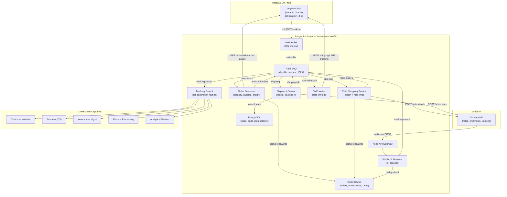

# Task 2: Architecture Design — RetailCo × Shipium Integration

---

## A. Component Diagram

### System Overview

The integration is built as a set of lightweight, independently deployable microservices running on RetailCo's existing Kubernetes cluster. Services communicate asynchronously through RabbitMQ (already in-house), with Redis for caching and PostgreSQL for integration state. The design fully decouples the slow OMS from time-sensitive Shipium operations.

```
┌─────────────────────────────────────────────────────────────────────────────────────┐
│                          RetailCo On-Prem / VPN Boundary                            │
│                                                                                     │
│   ┌─────────────┐                                                                   │
│   │  Legacy OMS  │ ◄── Java 8 Monolith, Oracle DB                                  │
│   │  (REST API)  │     3-5s responses, 100 req/min                                  │
│   └──────┬───▲──┘                                                                   │
│          │   │                                                                       │
│       poll  write-back                                                               │
│          │   │                                                                       │
╠══════════╪═══╪══════════════════════════════════════════════════════════════════════╣
│          │   │        Integration Layer (Kubernetes — AWS)                           │
│          │   │                                                                       │
│   ┌──────▼───┴──────┐      ┌──────────────┐      ┌──────────────────┐              │
│   │   OMS Poller     │─────►│  RabbitMQ    │◄─────│  OMS Writer      │              │
│   │   Service        │      │  (Broker)    │      │  Service         │              │
│   └─────────────────┘      │              │      └──────────────────┘              │
│                             │   Queues:    │                                        │
│   ┌─────────────────┐      │   • new-orders│     ┌──────────────────┐              │
│   │   Order          │◄─────│   • rate-req  │────►│  Rate Shopping    │              │
│   │   Processor      │─────►│   • ship-req  │     │  Service         │              │
│   └─────────────────┘      │   • tracking  │     └──────────────────┘              │
│                             │   • oms-wb    │                                       │
│   ┌─────────────────┐      │   • dlq-*     │     ┌──────────────────┐              │
│   │   Webhook        │─────►│              │────►│  Tracking         │              │
│   │   Receiver       │      └──────────────┘     │  Fanout Service   │              │
│   └─────────────────┘                            └──────────────────┘              │
│                                                                                     │
│   ┌─────────────────┐      ┌──────────────┐                                        │
│   │   Redis          │      │  PostgreSQL   │                                       │
│   │   (Cache)        │      │  (State)      │                                       │
│   └─────────────────┘      └──────────────┘                                        │
│                                                                                     │
│   ┌─────────────────┐                                                               │
│   │   Kong API       │ ◄── Existing API Gateway                                    │
│   │   Gateway        │                                                              │
│   └─────────────────┘                                                               │
│                                                                                     │
╠═════════════════════════════════════════════════════════════════════════════════════╣
│                          External Services                                          │
│                                                                                     │
│   ┌──────────────┐    ┌────────────┐   ┌────────────┐   ┌────────────────────┐     │
│   │  Shipium API  │    │  Zendesk   │   │  Customer   │   │  WMS / Returns /   │     │
│   │  (Rates,      │    │  (CS       │   │  Website    │   │  Analytics         │     │
│   │   Shipments,  │    │  Platform) │   │  (Tracking) │   │  (Downstream)      │     │
│   │   Tracking)   │    └────────────┘   └────────────┘   └────────────────────┘     │
│   └──────────────┘                                                                  │
└─────────────────────────────────────────────────────────────────────────────────────┘
```

### Service Descriptions


| Service                     | Responsibility                                                                                                                                                                                                                                        | Scaling Model                                               |
| --------------------------- | ----------------------------------------------------------------------------------------------------------------------------------------------------------------------------------------------------------------------------------------------------- | ----------------------------------------------------------- |
| **OMS Poller**              | Polls OMS `GET /orders` on a schedule. Discovers new/changed orders, publishes order IDs to `new-orders` queue. Manages API budget.                                                                                                                   | Single instance (leader-elected) to prevent duplicate polls |
| **Order Processor**         | Consumes from `new-orders`. Fetches full order details from OMS (via cache-aside through Redis). Classifies order eligibility, validates data quality, enriches with warehouse config. Publishes to `rate-req` or `ship-req` depending on order type. | Horizontally scalable (2-4 replicas)                        |
| **Rate Shopping Service**   | Consumes from `rate-req`. Calls Shipium `POST /rates` (single) or `POST /rates/batch` (batched). Selects optimal carrier/service based on business rules. Publishes selected rate + order to `ship-req`.                                              | Horizontally scalable (2-4 replicas)                        |
| **Shipment Creator**        | Consumes from `ship-req`. Calls Shipium `POST /shipments` to create label. Publishes shipping info to `oms-wb` queue for write-back and to `tracking` queue for downstream notification.                                                              | Horizontally scalable (2-4 replicas)                        |
| **OMS Writer**              | Consumes from `oms-wb`. Writes shipping info and tracking updates back to OMS via `POST /orders/{id}/shipping` and `PUT /orders/{id}/tracking`. Rate-limited to stay within 100 req/min budget.                                                       | Single instance with internal rate limiter                  |
| **Webhook Receiver**        | Receives Shipium webhook POSTs (`tracking.updated`, `shipment.delivered`, `shipment.exception`). Validates signatures. Publishes to `tracking` queue and `oms-wb` queue.                                                                              | 2+ replicas behind Kong for HA                              |
| **Tracking Fanout Service** | Consumes from `tracking`. Fans out tracking events to all downstream systems (website, Zendesk, WMS, returns, analytics) using per-destination sub-queues with independent retry logic.                                                               | Horizontally scalable (2-3 replicas)                        |


### Data Stores


| Store          | Purpose                     | Data                                                                                                   | TTL / Retention                                      |
| -------------- | --------------------------- | ------------------------------------------------------------------------------------------------------ | ---------------------------------------------------- |
| **Redis**      | Cache layer for OMS data    | Order details, warehouse configs, Shipium rate responses, OMS poll cursors                             | Orders: 1 hour. Warehouses: 4 hours. Rates: 2 hours. |
| **PostgreSQL** | Integration state and audit | Order processing state machine, shipment records, tracking events, dead-letter audit, idempotency keys | 90-day rolling retention, archived to S3             |


---

## B. Technology Choices

### 1. Integration Pattern: Event-Driven Middleware with Async Queues

**Choice:** Asynchronous, event-driven middleware layer with a message broker decoupling every stage.

**Why not direct API-to-API:**

- The OMS is too slow (3-5s) and too rate-limited (100 req/min) for synchronous request chains. A direct integration would mean Shipium rate requests block on OMS reads, creating cascading timeouts.
- Direct integration couples the availability of the entire pipeline to the slowest component. If the OMS goes down for maintenance, all Shipium operations stop.

**Why not MuleSoft ESB:**

- RetailCo already has MuleSoft, but it has license user limits, performance issues of its own, and not all developers are familiar with it. Adding another integration to MuleSoft increases the "integration spaghetti" problem Jennifer cited. A standalone service layer is more maintainable by the 3-developer team and doesn't require MuleSoft expertise.

**Why event-driven:**

- Each stage (poll → process → rate-shop → create shipment → write-back → fan-out) operates at a different speed and has different failure modes. Queues between stages provide natural buffering, backpressure, and independent retry. If Shipium is slow, orders queue safely. If the OMS is down, write-backs queue until it recovers.

### 2. Message Queue: RabbitMQ

**Choice:** RabbitMQ with durable queues, manual acknowledgment, and dead-letter exchanges.

**Justification:**

- RetailCo already operates RabbitMQ and has institutional knowledge. No new procurement, licensing, or training required.
- RabbitMQ's routing model (exchanges + queues) maps cleanly to the fan-out pattern needed for tracking distribution to 5 downstream systems.
- At 50K orders/day (~35/min average, ~100/min peak bursts), RabbitMQ handles the volume easily without the operational complexity of Kafka.
- Dead-letter exchanges (DLX) provide built-in handling for messages that fail after max retries, enabling human review without losing data.

**Why not Kafka:**

- Kafka would be appropriate at 10-100x the volume. At 50K orders/day, it adds operational overhead (ZooKeeper/KRaft, topic partition management, consumer group coordination) without proportional benefit. RabbitMQ is simpler to operate for a 3-person team.

**Queue Topology:**


| Queue               | Producer                           | Consumer                 | Purpose                                            |
| ------------------- | ---------------------------------- | ------------------------ | -------------------------------------------------- |
| `new-orders`        | OMS Poller                         | Order Processor          | New/changed order IDs discovered via polling       |
| `rate-req`          | Order Processor                    | Rate Shopping Service    | Validated orders needing carrier selection         |
| `rate-req-priority` | Order Processor                    | Rate Shopping Service    | High-value or rush orders needing real-time rates  |
| `ship-req`          | Rate Shopping Service              | Shipment Creator         | Orders with selected carrier/rate, ready for label |
| `oms-writeback`     | Shipment Creator, Webhook Receiver | OMS Writer               | Shipping info and tracking updates to push to OMS  |
| `tracking-fanout`   | Webhook Receiver, Shipment Creator | Tracking Fanout Service  | Tracking events to distribute downstream           |
| `dlq-`*             | Any (on failure)                   | Manual review / alerting | Dead-letter queues per stage for failed messages   |


### 3. Data Storage

**Redis (cache):**

- **Purpose:** Cache OMS responses to avoid redundant slow API calls. Cache Shipium rate responses (valid 1-4 hours per Shipium best practices). Cache warehouse configurations (change infrequently).
- **Justification:** Redis is a natural fit for cache-aside with TTL-based expiry. Runs on Kubernetes as a StatefulSet or via AWS ElastiCache. Minimal operational burden.

**PostgreSQL (state):**

- **Purpose:** Durable store for the order processing state machine (tracks each order through poll → process → rate → ship → write-back), shipment records, idempotency keys (to prevent duplicate shipments), and audit trail.
- **Justification:** RetailCo's newer services run on Kubernetes with standard relational databases. PostgreSQL is well-understood, supports ACID transactions for state machine integrity, and integrates with their existing Datadog/ELK monitoring. At 50K orders/day, a single PostgreSQL instance with proper indexing is more than sufficient.

**Why not MongoDB:**

- RetailCo has some MongoDB, but the integration state is inherently relational (order → shipment → tracking events, with foreign keys and transactional state transitions). PostgreSQL is the right tool here.

### 4. Hosting / Infrastructure

**Choice:** AWS Kubernetes (EKS), using RetailCo's existing cluster and deployment pipeline.

- All integration services deployed as Kubernetes Deployments with Helm charts.
- Kong API Gateway (existing) fronts the Webhook Receiver endpoint for Shipium callbacks.
- VPN connection to on-prem for OMS API access (existing network path).
- GitLab CI/CD (existing) for automated build/test/deploy.
- Blue-green deployments using existing Kubernetes capability.
- Datadog for metrics, ELK for logs, PagerDuty for alerts (all existing).

**No new infrastructure required.** This is critical given budget constraints and the 3-person team. Every component runs on tools RetailCo already operates.

### 5. Programming Language: Go

**Choice:** Go for all integration services.

**Justification:**

- **Concurrency model:** Go's goroutines are ideal for services that manage many concurrent I/O operations (OMS polling, Shipium API calls, queue consumption). The OMS Writer needs to carefully rate-limit outbound calls — Go's `time.Ticker` and channel-based concurrency make this straightforward.
- **Performance:** Compiled, low memory footprint. Each service runs in a small container (~50-100MB RAM), keeping Kubernetes resource costs low.
- **Operational simplicity:** Single static binary per service — no runtime dependencies, no JVM tuning, no node_modules. This matters for a 3-person team maintaining the system long-term.
- **Kubernetes ecosystem fit:** Go is the lingua franca of the Kubernetes ecosystem. Libraries for RabbitMQ (`amqp091-go`), Redis (`go-redis`), PostgreSQL (`pgx`), HTTP clients, and structured logging are mature and well-maintained.
- **Fast build/deploy:** Sub-minute build times, small container images (~20MB scratch-based), fast rollouts.

**Why not Java:**

- RetailCo's OMS is Java, but their newer services are on Kubernetes and they want to avoid creating "another beast." Java's heavier resource footprint (JVM memory, startup time) and the team's expressed fatigue with their Java monolith make it a poor cultural fit.

**Why not Python/Node.js:**

- Both are viable but offer weaker concurrency primitives for the specific pattern of rate-limited, multi-stage I/O pipelines. Go's explicit concurrency model makes rate limiter and circuit breaker behavior easier to reason about.

---

## C. Handling the "Slow OMS" Constraint

The OMS is the primary bottleneck: 3-5 second response times, 100 requests/minute rate limit, no webhooks, no batch endpoints, timeouts during peak hours. The architecture addresses this through five specific techniques:

### Technique 1: Decoupled Polling with Smart Cursors

**Problem:** The OMS has no webhooks, so we must poll for new orders. But polling consumes API budget and each call takes 3-5 seconds.

**Solution:** The OMS Poller runs on a 30-second interval and calls `GET /orders?status=pending&created_after={cursor}&limit=500`. The `created_after` cursor is persisted in Redis and advances with each successful poll. This means:

- One API call discovers up to 500 new orders (the OMS max page size).
- At 50K orders/day (~35/min), a single poll every 30 seconds retrieves ~17 orders on average — well within the 500 limit.
- At 150K peak (~104/min), each poll retrieves ~52 orders — still one call per cycle.
- The poller uses **2 API calls per minute** at steady state (poll + status check).

The poller publishes only order IDs to the `new-orders` queue — it does not fetch full order details. This separates discovery from enrichment and lets the Order Processor manage detail fetches against the remaining API budget.

### Technique 2: Aggressive Cache-Aside with Redis

**Problem:** Fetching full order details via `GET /orders/{id}` costs 3-5 seconds per call and consumes one API request. Some orders may be read multiple times (retries, re-processing).

**Solution:** Every OMS API response is cached in Redis with the following TTLs:

- **Order details:** 60-minute TTL. Once fetched, the order detail is served from cache for all downstream services. If the Order Processor, Rate Shopping Service, or OMS Writer need order data, they read from Redis first.
- **Warehouse configurations:** 4-hour TTL. Warehouse configs (`GET /warehouses/{id}`) change rarely. We pre-warm the cache at service startup and refresh lazily.
- **Rate responses from Shipium:** 2-hour TTL. Shipium's best practices say rates are valid for 1-4 hours. For standard orders, a cached rate is acceptable.

**Budget impact:** Cache hits eliminate redundant OMS calls. Instead of fetching an order 3-4 times across the pipeline, we fetch it once.

### Technique 3: OMS API Budget Manager (Token Bucket Rate Limiter)

**Problem:** 100 requests/minute, hard cutoff, single API key, no ability to increase. All integration operations share this budget.

**Solution:** The OMS Writer and OMS Poller share a centralized token-bucket rate limiter backed by Redis. The limiter enforces a global cap of **90 requests/minute** (leaving a 10% safety margin) and allocates budget by priority:


| Priority          | Budget Allocation   | Operations                                                      |
| ----------------- | ------------------- | --------------------------------------------------------------- |
| **P0 — Critical** | 40 req/min reserved | Shipping info write-back, tracking write-back (outbound to OMS) |
| **P1 — High**     | 30 req/min reserved | New order detail fetches (cache misses)                         |
| **P2 — Normal**   | 15 req/min reserved | Order polling, warehouse config refreshes                       |
| **P3 — Low**      | 5 req/min reserved  | Retry backlog, non-urgent updates                               |


During peak hours when OMS response times degrade to 5-12 seconds, the effective throughput drops because each in-flight request holds a token longer. The limiter handles this by queueing excess requests in RabbitMQ rather than dropping them — backpressure propagates naturally through the queue system.

### Technique 4: Fully Async Pipeline — Never Block on the OMS

**Problem:** If any service makes a synchronous call chain through the OMS (e.g., fetch order → rate shop → create shipment → write back, all in one request), a 5-second OMS timeout cascades through the entire pipeline.

**Solution:** Every OMS interaction is asynchronous and decoupled by a queue:

1. Poller discovers order → publishes ID to queue → **done** (OMS call complete).
2. Order Processor fetches details (or reads cache) → publishes enriched order to queue → **done**.
3. Rate Shopping calls Shipium (fast: 200-500ms) → publishes result to queue → **done**.
4. Shipment Creator calls Shipium (fast: 500-1000ms) → publishes to write-back queue → **done**.
5. OMS Writer drains the write-back queue at a controlled rate (within budget) → **done**.

No service ever waits for the OMS synchronously. The OMS Writer is the only service that talks to the OMS for writes, and it operates at its own pace, governed by the rate limiter. If the OMS is slow, the write-back queue grows — orders have already been shipped, labels printed, and Shipium notified. The OMS gets updated eventually (target: within 5 minutes).

### Technique 5: Circuit Breaker on OMS Calls

**Problem:** During peak hours, the OMS times out (>30 seconds). Continuing to send requests wastes API budget on calls that will fail and creates a backlog of timed-out connections.

**Solution:** Every service that calls the OMS wraps calls in a circuit breaker (using a Go library like `sony/gobreaker`):

- **Closed (normal):** Requests pass through. Timeout set to 15 seconds (per OMS docs recommendation).
- **Open (tripped):** After 5 consecutive failures or >50% failure rate in a 60-second window, the breaker opens. All OMS calls are short-circuited for 60 seconds. Messages remain in their respective queues.
- **Half-open (probing):** After 60 seconds, one request is allowed through. If it succeeds, the breaker closes. If it fails, it stays open for another 60 seconds.

When the circuit breaker is open, the poller pauses, the OMS Writer stops draining the write-back queue, and all operations that depend on OMS data serve from Redis cache. Shipium operations (rate shopping, shipment creation, tracking) continue uninterrupted because they don't depend on the OMS being available in real-time.

### API Budget Math (Steady State — 50K orders/day)


| Operation                        | Calls/Day    | Calls/Min (avg) | Notes                                                        |
| -------------------------------- | ------------ | --------------- | ------------------------------------------------------------ |
| Poll new orders                  | ~2,880       | 2               | Every 30s, 1 call returning up to 500 IDs                    |
| Fetch order details (cache miss) | ~50,000      | ~35             | 1 per new order; cache eliminates re-reads                   |
| Write shipping info              | ~50,000      | ~35             | 1 per shipped order                                          |
| Write tracking milestones        | ~15,000      | ~10             | ~3 key milestones per order (shipped, in-transit, delivered) |
| Warehouse config refresh         | ~360         | <1              | 50 warehouses refreshed every ~4 hours                       |
| **Total**                        | **~118,240** | **~82**         | **Within 100 req/min budget**                                |


During peak (150K/day), the detail-fetch and write-back operations scale to ~104/min each — exceeding the 100 req/min budget. Mitigation strategies for peak:

- Increase cache TTLs to reduce re-fetch.
- Batch tracking write-backs (write only `shipped` and `delivered`, skip intermediate events).
- Request a second API key from RetailCo for peak season (escalation item).
- Accept slightly increased latency (orders processed within 10 minutes instead of 5).

---

## D. Data Flow Documentation

### Flow 1: Order Submission — OMS to Shipium

```
┌─────────┐    ┌───────────┐    ┌───────────┐    ┌────────────┐    ┌──────────┐
│  Legacy  │    │   OMS     │    │  Order    │    │   Rate     │    │ Shipment │
│   OMS    │    │  Poller   │    │ Processor │    │  Shopping  │    │ Creator  │
└────┬─────┘    └─────┬─────┘    └─────┬─────┘    └─────┬──────┘    └────┬─────┘
     │                │                │                │               │
     │ GET /orders    │                │                │               │
     │ ?status=pending│                │                │               │
     │ &created_after │                │                │               │
     │◄───────────────┤                │                │               │
     │                │                │                │               │
     │  order IDs     │                │                │               │
     ├───────────────►│                │                │               │
     │                │                │                │               │
     │                │──publish──►    │                │               │
     │                │ [new-orders]   │                │               │
     │                │                │                │               │
     │ GET /orders/   │                │                │               │
     │ {order_id}     │                │                │               │
     │◄────────────────────────────────┤                │               │
     │                │                │                │               │
     │  full order    │                │                │               │
     ├────────────────────────────────►│                │               │
     │                │                │                │               │
     │                │                │  ┌──────────┐  │               │
     │                │                │  │ Classify: │  │               │
     │                │                │  │ eligible? │  │               │
     │                │                │  │ validate  │  │               │
     │                │                │  │ enrich    │  │               │
     │                │                │  └──────────┘  │               │
     │                │                │                │               │
     │                │                │──publish──►    │               │
     │                │                │ [rate-req]     │               │
     │                │                │                │               │
     │                │                │                │  ┌──────────┐ │
     │                │                │                │  │ Shipium  │ │
     │                │                │                │  │ POST     │ │
     │                │                │                │  │ /rates   │ │
     │                │                │                │  │ (batch)  │ │
     │                │                │                │  └──────────┘ │
     │                │                │                │               │
     │                │                │                │──publish──►   │
     │                │                │                │ [ship-req]    │
     │                │                │                │               │
     │                │                │                │            ┌──┴────────┐
     │                │                │                │            │ Shipium   │
     │                │                │                │            │ POST      │
     │                │                │                │            │/shipments │
     │                │                │                │            └──┬────────┘
     │                │                │                │               │
     │                │                │                │               │──publish──►
     │                │                │                │               │ [oms-writeback]
     │                │                │                │               │ [tracking-fanout]
```

**Step-by-step:**

1. **OMS Poller** calls `GET /orders?status=pending&created_after={last_cursor}&limit=500` every 30 seconds. The OMS returns a page of order summaries (2-4 seconds).
2. Poller extracts order IDs, updates the `created_after` cursor in Redis, and publishes each order ID as a message to the `new-orders` RabbitMQ queue.
3. **Order Processor** consumes from `new-orders`. For each order ID, it checks Redis cache first. On cache miss, it calls `GET /orders/{order_id}` (3-5 seconds) and caches the response.
4. Order Processor runs classification logic:
  - Is this order type eligible for Shipium? (Based on configured rules: ecommerce, retail, marketplace, gift → yes; b2b, store_transfer, return_to_stock, drop_ship → no/deferred.)
  - Is data quality sufficient? (Valid address, weight/dimensions present, no duplicates via idempotency key check in PostgreSQL.)
  - Enriches with warehouse config from Redis cache (carrier accounts, capabilities, cutoff times).
5. If eligible, publishes enriched order to `rate-req` queue (or `rate-req-priority` for rush/high-value orders). If ineligible, logs reason and marks order as skipped in PostgreSQL.
6. **Rate Shopping Service** consumes from `rate-req`. Accumulates orders for 30-60 seconds, then calls Shipium `POST /rates/batch` with up to 100 orders per batch. Applies business rules (carrier restrictions, DC preferences, hazmat constraints) to filter the returned rates and selects the optimal carrier/service. Publishes order + selected rate to `ship-req`.
7. **Shipment Creator** consumes from `ship-req`. Calls Shipium `POST /shipments` with the selected rate ID. Receives tracking number, label URL, and cost. Records the shipment in PostgreSQL. Publishes shipping info to `oms-writeback` queue (for OMS update) and `tracking-fanout` queue (for downstream systems).
8. **OMS Writer** consumes from `oms-writeback` at a rate-limited pace. Calls `POST /orders/{id}/shipping` on the OMS to record carrier, tracking number, cost, and estimated delivery.

### Flow 2: Rate Request and Response (Detail)

```
┌──────────────┐         ┌─────────────┐         ┌─────────────┐
│ Rate Shopping │         │   Redis     │         │ Shipium API │
│   Service     │         │   Cache     │         │             │
└──────┬───────┘         └──────┬──────┘         └──────┬──────┘
       │                        │                        │
       │  Check rate cache      │                        │
       │  (origin+dest+weight   │                        │
       │   +service hash)       │                        │
       ├───────────────────────►│                        │
       │                        │                        │
       │  Cache HIT ◄───────────┤                        │
       │  (return cached rates) │                        │
       │  TTL: 2 hours          │                        │
       │                        │                        │
       │  — OR —                │                        │
       │                        │                        │
       │  Cache MISS            │                        │
       │◄───────────────────────┤                        │
       │                        │                        │
       │  POST /rates/batch     │                        │
       │  (up to 100 requests)  │                        │
       ├────────────────────────────────────────────────►│
       │                        │                        │
       │  Rates response        │                        │
       │  (200-500ms per batch) │                        │
       │◄────────────────────────────────────────────────┤
       │                        │                        │
       │  Cache rates           │                        │
       ├───────────────────────►│                        │
       │                        │                        │
       │  ┌─────────────────┐   │                        │
       │  │ Apply rules:    │   │                        │
       │  │ • DC carrier    │   │                        │
       │  │   preferences   │   │                        │
       │  │ • Hazmat check  │   │                        │
       │  │ • Destination   │   │                        │
       │  │   restrictions  │   │                        │
       │  │ • Cost vs speed │   │                        │
       │  │   optimization  │   │                        │
       │  └─────────────────┘   │                        │
       │                        │                        │
       │  Publish selected rate │                        │
       │  ──► [ship-req] queue  │                        │
```

**Two processing tiers:**


| Tier          | Criteria                                                                   | Behavior                                                                                      | Latency       |
| ------------- | -------------------------------------------------------------------------- | --------------------------------------------------------------------------------------------- | ------------- |
| **Real-time** | Rush priority, order value >$500, marketplace with SLA deadline within 24h | Bypass batch accumulation. Call Shipium `POST /rates` individually. No rate caching.          | <2 seconds    |
| **Batch**     | All other eligible orders                                                  | Accumulate for 30-60 seconds, then call `POST /rates/batch`. Use cached rates when available. | 30-90 seconds |


**Business rules application:**
The Rate Shopping Service loads the carrier selection rules from PostgreSQL (synced from Shipium's `GET /carrier-rules` and augmented with RetailCo-specific overrides). Rules are applied as filters on the returned rates:

1. Remove carriers not available at the fulfilling DC.
2. Remove services that violate restrictions (no ground to AK/HI, hazmat only UPS/FedEx Ground).
3. Apply signature requirement for orders >$500.
4. Rank remaining options by cost (default) or speed (for rush orders).
5. Select the top-ranked option.

### Flow 3: Tracking Update — Carrier → Shipium → OMS + Downstream

```
┌─────────┐    ┌──────────┐    ┌──────────┐    ┌───────────┐    ┌────────────────┐
│ Carrier  │    │ Shipium  │    │ Webhook  │    │  Tracking │    │  Downstream    │
│ (UPS,    │    │ Platform │    │ Receiver │    │  Fanout   │    │  Systems       │
│  FedEx)  │    │          │    │          │    │  Service  │    │                │
└────┬─────┘    └────┬─────┘    └────┬─────┘    └─────┬─────┘    └───────┬────────┘
     │               │               │                │                  │
     │  Scan event   │               │                │                  │
     ├──────────────►│               │                │                  │
     │               │               │                │                  │
     │               │  POST webhook │                │                  │
     │               │  (tracking.   │                │                  │
     │               │   updated)    │                │                  │
     │               ├──────────────►│                │                  │
     │               │               │                │                  │
     │               │               │ ┌────────────┐ │                  │
     │               │               │ │ Validate   │ │                  │
     │               │               │ │ signature  │ │                  │
     │               │               │ │ Parse event│ │                  │
     │               │               │ │ Dedup check│ │                  │
     │               │               │ └────────────┘ │                  │
     │               │               │                │                  │
     │               │  HTTP 200     │                │                  │
     │               │◄──────────────┤                │                  │
     │               │               │                │                  │
     │               │               │──publish──►    │                  │
     │               │               │[tracking-      │                  │
     │               │               │ fanout]         │                  │
     │               │               │                │                  │
     │               │               │──publish──►    │                  │
     │               │               │[oms-writeback] │                  │
     │               │               │                │                  │
     │               │               │                │ ┌──────────────┐ │
     │               │               │                │ │ Route by     │ │
     │               │               │                │ │ destination: │ │
     │               │               │                │ └──────┬───────┘ │
     │               │               │                │        │         │
     │               │               │                │  ┌─────▼───────┐ │
     │               │               │                │  │ Website API ├─►  Real-time push
     │               │               │                │  │ Zendesk API ├─►  Real-time push
     │               │               │                │  │ WMS API     ├─►  Near-real-time
     │               │               │                │  │ Returns API ├─►  Near-real-time
     │               │               │                │  │ Analytics   ├─►  Batch (hourly)
     │               │               │                │  └─────────────┘
```

**Step-by-step:**

1. Carrier scans a package, generating a tracking event (e.g., `in_transit`, `out_for_delivery`, `delivered`).
2. Shipium receives the carrier event and sends an HTTP POST to the registered webhook URL (`https://integration.retailco.com/webhooks/shipium`) with the event payload, including `external_order_id`, `tracking_number`, `status`, `location`, and `estimated_delivery_date`.
3. **Webhook Receiver** (behind Kong API Gateway, 2+ replicas) validates the `X-Shipium-Signature` header against the webhook secret. Checks the event ID against a deduplication set in Redis (5-minute TTL) to prevent processing duplicate deliveries from Shipium's retry logic. Returns HTTP 200 immediately.
4. Webhook Receiver publishes the tracking event to two queues:
  - `oms-writeback`: For the OMS Writer to call `PUT /orders/{id}/tracking` on the OMS.
  - `tracking-fanout`: For distribution to all downstream systems.
5. **OMS Writer** consumes from `oms-writeback` and writes the tracking update to the OMS at a rate-limited pace. Only key milestones are written back (shipped, in_transit, out_for_delivery, delivered, exception) to conserve API budget.
6. **Tracking Fanout Service** consumes from `tracking-fanout` and routes to per-destination sub-queues:


| Destination                 | Delivery Method | Latency Target | Retry Policy                             |
| --------------------------- | --------------- | -------------- | ---------------------------------------- |
| Customer Website            | REST API push   | <30 seconds    | 3 retries, exponential backoff, then DLQ |
| Zendesk (CS Platform)       | REST API push   | <60 seconds    | 3 retries, exponential backoff, then DLQ |
| Warehouse Management System | REST API push   | <5 minutes     | 5 retries, linear backoff, then DLQ      |
| Returns Processing          | REST API push   | <5 minutes     | 5 retries, linear backoff, then DLQ      |
| Analytics Platform          | Batch file/API  | Hourly batch   | Accumulate events, push hourly           |


Each sub-queue has its own consumer with independent retry logic, so a failure in the Zendesk integration doesn't block website updates. Failed messages route to a per-destination dead-letter queue for investigation.

---

## Architecture Diagram — Mermaid (for rendering)

The following Mermaid diagram can be rendered in any Markdown viewer that supports Mermaid (GitHub, GitLab, Notion, etc.):




---

## Summary of Key Architectural Decisions


| Decision            | Choice                                        | Primary Driver                                        |
| ------------------- | --------------------------------------------- | ----------------------------------------------------- |
| Integration pattern | Event-driven async middleware                 | OMS too slow for synchronous chains                   |
| Message broker      | RabbitMQ                                      | Already in-house, right scale, team knows it          |
| Cache               | Redis                                         | Eliminate redundant OMS calls, rate response caching  |
| State store         | PostgreSQL                                    | Transactional state machine, audit trail, idempotency |
| Language            | Go                                            | Concurrency model, small footprint, Kubernetes-native |
| Infrastructure      | Existing AWS EKS + Kong + GitLab CI           | No new procurement, budget-constrained                |
| OMS interaction     | Poll + cache + rate-limit + circuit-break     | Can't modify OMS, must work around it                 |
| Shipium tracking    | Webhooks (push) not polling                   | Lower latency, no API budget consumed                 |
| Downstream fan-out  | Per-destination queues with independent retry | Isolate failures, different latency SLAs              |
| Rate shopping       | Batch (default) + real-time (priority)        | Balance API budget with latency needs                 |


