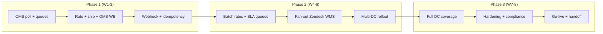

# Task 4: Phased Implementation Approach

**Target go-live:** March 15, 2026 (8 weeks from kickoff)  
**Constraint:** Full scope (all order types, all DCs, all downstream systems, full business rules) is not achievable in 8 weeks without unacceptable risk. This plan sequences value delivery, de-risks the legacy OMS, and leaves a clear post-go-live backlog.

---

## Phase 1: MVP (Weeks 1–3)

### Minimum Viable Integration

The MVP proves that orders can flow from the OMS → Shipium → labels, with shipping and tracking written back to the OMS, for **one order family** and **one or two distribution centers**, behind a **feature flag**. No marketplace Prime SLAs, no full five-system fan-out, and no complete 200-rule engine yet.

### Capabilities That Must Be Included

| Capability | Rationale |
|---|---|
| **OMS polling + cursor** | Only way to discover orders; validates rate-limit math and poller stability. |
| **Message queue between stages** | Proves async decoupling from the slow OMS before scale increases. |
| **Order classification (MVP rules)** | Explicit allowlist: e.g. `ecommerce` + `retail` only, `status in (pending, processing)`, exclude obvious non-starters. |
| **Rate shopping** | Shipium `POST /rates` (single-order acceptable in MVP); proves carrier account wiring and negotiated-rate behavior. |
| **Shipment creation + label** | Shipium `POST /shipments` + label retrieval; proves end-to-end fulfillment path. |
| **OMS write-back** | `POST /orders/{id}/shipping` and initial `PUT /orders/{id}/tracking` for shipped + delivered milestones. |
| **Webhook receiver (Shipium)** | Validates signature handling, idempotency, and at least one downstream path for tracking. |
| **PostgreSQL state + idempotency** | Prevents duplicate shipments during retries (critical from day one). |
| **Redis cache (orders + warehouses)** | Reduces OMS load; required to stay near rate limits as volume grows. |
| **Basic observability** | Structured logs, Datadog metrics (poll latency, queue depth, OMS 429s, Shipium errors), one PagerDuty alert on critical failure. |
| **Non-prod environments** | Dev + staging with OMS test API; smoke tests on every deploy. |

### What Can Be Deferred (Explicitly Out of MVP)

- **Marketplace orders** (Prime SLAs, tight deadlines) — highest complexity and highest penalty for mistakes; needs SLA-aware queues and more testing.
- **Gift orders** (special packaging, no-price-on-docs) — business rules and QA surface area; defer until classification + packing rules are signed off.
- **B2B / LTL** — different carrier/service model; not in initial “parcel” path.
- **Full downstream fan-out** — MVP: OMS write-back + **one** additional consumer (e.g. customer website API or a single “tracking bus” topic). Zendesk, WMS, returns, analytics batch — later phases.
- **Batch rate API** (`POST /rates/batch`) — optional in MVP; single-order rates are simpler to debug.
- **Full business rules spreadsheet** — MVP uses a **small, version-controlled rules subset** (hazmat ground-only, AK/HI no ground, signature >$500) agreed with logistics; expand in Phase 2.
- **Multi-DC rollout** — MVP is **1–2 DCs** (one regional DC + optionally one store fulfillment) with feature flag `shipium_enabled_dc`.
- **Circuit breaker tuning, VPN-specific probes** — start with timeouts/retries; harden in Phase 3.
- **MuleSoft integration** — if any downstream path *requires* MuleSoft, MVP uses a direct API stub or manual file drop agreed with IT; formal MuleSoft routing in Phase 2+.

### Key Deliverables

1. Architecture decision record (ADR): integration pattern, queue choice, language, MVP scope boundaries.
2. Deployed services on Kubernetes (dev/staging): Poller, Order Processor, Rate Shopping, Shipment Creator, OMS Writer, Webhook Receiver (minimal set).
3. RabbitMQ queues + DLQs wired with runbooks (“what to do when DLQ grows”).
4. Feature flag service or config map: per-DC and per-order-type enablement.
5. Test plan executed in staging: happy path, OMS timeout simulation, duplicate message redelivery, idempotent second shipment attempt.
6. Security: secrets in vault, no PAN in logs, API keys not in repo.

### Success Criteria

| Criterion | Target |
|---|---|
| **Functional** | ≥99% of flagged MVP orders in staging complete: rate → label → OMS shipping fields → at least one tracking milestone written back. |
| **Idempotency** | Zero duplicate shipments in 1,000 synthetic retry scenarios. |
| **Latency (MVP volume)** | Median time from `pending` discovery to label created **<15 minutes** in staging (acknowledging poll interval + queue; not production SLA yet). |
| **OMS budget** | No sustained **429** rate from integration in 24h soak at MVP projected call rate. |
| **Operations** | Tier 1 can answer: “Is Shipium on for this DC?” and “Where is this order in the pipeline?” using dashboard + order_id lookup. |

### Dependencies / Blockers

| Dependency | Owner | Notes |
|---|---|---|
| OMS test API key + stable test data | RetailCo | Without this, integration testing is theoretical. |
| **Signed order-type eligibility matrix** | RetailCo + Shipium | Unblocks classification logic and avoids building the wrong product. |
| Shipium sandbox credentials + carrier account mapping for pilot DCs | Shipium + RetailCo logistics | |
| Kong route + TLS cert for webhook URL | RetailCo platform | Shipium cannot push tracking without a reachable endpoint. |
| VPN / network path from EKS to OMS (staging) | RetailCo network | Validate before Week 2 load test. |
| Subset of business rules (written, not “spreadsheet somewhere”) | RetailCo ops | Minimum hazmat / geography / signature rules. |

### Risks

| Risk | Mitigation |
|---|---|
| **Eligibility still vague at end of Week 1** | Time-box: default MVP = `ecommerce` only if no sign-off; document expansion as Phase 2 gate. |
| **OMS test environment not representative** | Week 2 shadow read-only poll against prod (read-only key) if allowed — or accept higher prod risk and narrow DC count. |
| **Scope creep (“just add marketplace”)** | Change control: anything beyond ADR scope requires explicit phase move. |
| **Team distraction** (3 devs, part-time QA) | Single integration owner; freeze non-critical feature requests during MVP. |

---

## Phase 2: Enhancement (Weeks 4–6)

### Features Added

| Feature | Description |
|---|---|
| **Batch rate shopping** | Shipium `POST /rates/batch` (up to 100) + accumulation window; reduces Shipium API load and improves throughput. |
| **Expanded order types** | Add `gift`, `marketplace`, and/or `retail` store-ship flows per signed eligibility — each with its own validation branch. |
| **SLA-aware priority queues** | Marketplace orders with `sla_deadline` routed to priority queues; monitoring + alerts for “deadline < 2h”. |
| **Tracking fan-out v1** | Add **Zendesk** + **WMS** (highest operational pain from CS + warehouse). Website real-time push if API ready; otherwise defer to Phase 3. |
| **Returns + analytics** | Returns: webhook-driven “delivered” events to trigger refund workflows (near–real time). Analytics: hourly batch export to existing pipeline (S3/file/API). |
| **Expanded business rules** | Import more of the ~200 rules into versioned config or Shipium carrier-rules API; workflow for ops to request rule changes (ticket + deploy or config reload). |
| **Multi-DC rollout** | Enable Shipium per DC in waves (e.g. 5 DCs/week) with rollback flag per DC. |
| **Pre-shipment OMS status recheck** | Reduces cancelled-after-ship risk (Edge Case 2). |
| **Cancellation polling** | `GET /orders?status=cancelled&updated_after=…` on a conservative cadence within API budget. |

### Why These Were Not in MVP

| Item | Reason deferred |
|---|---|
| Batch rates | Debugging single-order rates first is faster; batch adds batching window + partial failure handling. |
| Marketplace / gift | Higher regulatory and SLA risk; need proven pipeline + monitoring before attaching revenue-critical paths. |
| Full fan-out | Each destination is its own integration contract, failure mode, and on-call surface — parallelize after core path is stable. |
| Many DCs at once | Rate limit and operational blast radius; phased rollout reduces March 15 cutover risk. |
| Full rule set | Requires located spreadsheet + owner; MVP runs on agreed subset to avoid blocking Weeks 1–2. |

### Key Deliverables

1. Production deployment to **pilot DCs** (subset of production traffic).
2. Fan-out consumers with **per-destination DLQs** and retry policies documented.
3. Grafana dashboards: OMS API budget utilization, queue age by priority, marketplace SLA bucket.
4. Runbooks: OMS 429 storm, Shipium outage, webhook secret rotation, “disable Shipium for DC X”.
5. Load test: simulate **peak-day order rate** for 2 hours against staging + extrapolated OMS budget (identify need for second API key or rule changes before Phase 3).

### Success Criteria

| Criterion | Target |
|---|---|
| **Pilot production** | ≥95% of **eligible** orders in pilot DCs flow through Shipium without manual carrier selection (aligns with customer success metric direction). |
| **Tracking** | ≥95% of tracking milestones reach OMS within **5 minutes** of webhook receipt (aligns with technical constraints success criteria). |
| **Downstream** | Zendesk + WMS: **<0.5%** DLQ rate over 7 days; each DLQ type has a documented recovery path. |
| **Marketplace** (if in scope this phase) | Late shipment rate stays **below Amazon threshold** during pilot (monitor daily). |

### Dependencies / Blockers

| Dependency | Notes |
|---|---|
| Downstream API contracts + credentials | Zendesk/WMS teams often slower than core dev — start integration specs in Week 3. |
| Located business rules spreadsheet + owner | Without it, rule expansion is guesswork. |
| RetailCo approval for pilot DC list + dates | Ops sign-off on which DCs go first. |
| Optional: second OMS API key or limit increase for peak | If load test fails budget math, escalate in Week 5 (not Week 8). |

### Risks

| Risk | Mitigation |
|---|---|
| **Pilot exposes OMS instability** | Circuit breaker + queue backpressure from Task 2; reduce pilot DC count temporarily. |
| **Fan-out failures flood on-call** | Start with 2 destinations; throttle parallelism; business hours-only paging for non-critical destinations. |
| **Rule import errors** | Shadow mode: log “would have selected different carrier” without changing production selection for N days. |

---

## Phase 3: Full Production (Weeks 7–8)

### Final Features

| Feature | Description |
|---|---|
| **Full DC rollout** | Enable all shipping-eligible DCs (target ~30) per rollout schedule, unless data shows budget risk — then complete remaining DCs in post-go-live Week 9. |
| **Remaining downstream paths** | Customer website real-time tracking (if not done in Phase 2), returns triggers, analytics aggregation tuning. |
| **Production hardening** | VPN/network health probe distinct from OMS app health; gradual backlog drain after incidents; rate-limiter tuning from production metrics. |
| **Security & compliance** | Quarterly key rotation drill, audit log sampling review, GDPR data minimization check on payloads stored in PostgreSQL. |
| **Blue-green + rollback** | Documented rollback: feature flag off → traffic falls back to legacy manual/carrier workflow within minutes. |
| **Training & handoff** | Tier 1 ops training, Tier 2 dev runbooks, escalation path to Shipium support. |

### Production Hardening (Explicit Checklist)

- [ ] Chaos or fault injection: OMS slow, OMS 429, Shipium 502, RabbitMQ node restart (in staging, then limited prod drill).
- [ ] Backup/restore tested for PostgreSQL (RPO 5 min per technical constraints).
- [ ] Alert noise review: no false-positive pages from maintenance windows (coordinate with RetailCo OMS calendar).
- [ ] Capacity: HPA on consumers based on queue depth; max replicas bounded to protect OMS Writer from self-DoS.

### What’s Left Post–Go-Live (Week 9+)

| Item | Rationale |
|---|---|
| **Deep MuleSoft consolidation** | If direct integrations were used for speed, refactor stable flows behind ESB only where license and team skills allow. |
| **Carrier invoice reconciliation job** | Needs historical invoice feeds; not blocking go-live. |
| **Product master data for weights/dims** | Fixes root cause of surcharge drift; long-term data program. |
| **Peak-season second key / limit negotiation** | If March load test still shows risk at 150K/day, production change may land just before Q4 peak. |
| **Advanced gift / B2B flows** | B2B LTL, complex gift combinations — expand once parcel path is boringly stable. |
| **Rule self-service UI** | Nice-to-have; start with tickets + config deploys. |

### Key Deliverables

1. **March 15 go-live** (or staged completion): all planned DCs on Shipium per rollout plan; feature flags documented.
2. Production monitoring pack: SLOs for processing latency, OMS budget, webhook success rate, DLQ depth.
3. Executive readout: cost vs. baseline (early read — full 15% savings validation needs more weeks of data).
4. Post-mortem template + first weekly review scheduled.

### Success Criteria (Go-Live)

| Criterion | Target (from provided materials) |
|---|---|
| **Eligible order routing** | **≥95%** of eligible orders through Shipium |
| **Tracking freshness** | Tracking updates to OMS / primary customer paths within **5 minutes** of carrier-visible event |
| **Delivery estimate accuracy** | On track toward **>90%** (measurement window may extend post–March 15; set baseline in Week 8) |
| **Reliability** | **99.5%** business-hours uptime for integration tier; **<0.1%** error rate on processed messages |
| **Zero order processing halt** | No sustained inability to process orders due to integration (rollback + manual path proven in drill) |

### Dependencies / Blockers

| Dependency | Notes |
|---|---|
| Production credentials + webhook URL in Shipium prod | Cutover checklist item; often blocked on security review — start Week 6. |
| Blackout windows (RetailCo change freeze) | Align deploy windows with RetailCo policy. |
| President’s Day (Feb 16, 2026) | Reduce capacity Week 6; buffer in schedule. |

### Risks

| Risk | Mitigation |
|---|---|
| **“Big bang” pressure for March 15** | Prefer **last DC wave** in Week 8 early days; keep 2–3 lower-volume DCs on legacy until Week 9 if schedule slips. |
| **Insufficient soak time** | Minimum 7 days of pilot at **full** projected call pattern before final wave. |
| **Success metrics not met immediately** | Pre-agree that cost and on-time % are **trailing** indicators reviewed at 30/60/90 days; go-live criteria focus on routing %, uptime, and zero processing halt. |

---

## Timeline at a Glance

| Week | Phase | Focus |
|---:|---|---|
| 1 | Phase 1 | Requirements lock (subset), environments, skeleton services, OMS poll + single rate path |
| 2 | Phase 1 | Shipment create, OMS write-back, webhook receiver, idempotency, staging E2E |
| 3 | Phase 1 | Pilot DC in staging + limited prod canary if approved; ops runbooks v0 |
| 4 | Phase 2 | Batch rates, priority queues, fan-out (Zendesk + WMS), multi-DC wave 1 |
| 5 | Phase 2 | Marketplace/gift if signed off; cancellation recheck; load test |
| 6 | Phase 2 | Multi-DC waves 2–3; dashboard + alert tuning; security review for prod |
| 7 | Phase 3 | Remaining DCs, website/returns/analytics completion, hardening drills |
| 8 | Phase 3 | Final DC enablement, go-live checklist, rollback drill, handoff |

---

## Dependency Diagram (Conceptual)

**Critical path:** OMS test access → core pipeline in staging → pilot DC → downstream contracts → production credentials → DC waves → go-live.
